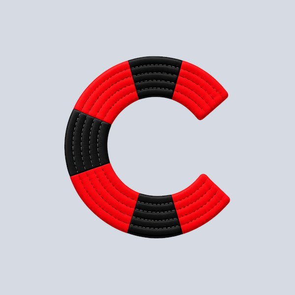

<p align="center">
  
</p>

# Choke 🥋⚡

A modern decentralized BJJ match scoring and publishing app via Nostr.

## What is Choke?

Choke lets you create, score, and publish Brazilian Jiu-Jitsu matches in real time using the Nostr protocol. Every scoring action is broadcast as a Nostr event, making match data open, verifiable, and accessible from any compatible dashboard.

## Features

- **Real-time scoring** — Takedowns (2pts), Guard Passes (3pts), Mount/Back Takes (4pts), Advantages, Penalties
- **Countdown timer** — Configurable match duration with second-by-second countdown
- **Decentralized** — All data published via Nostr (kind 31415 addressable events)
- **No accounts needed** — Nostr keypair generated on install
- **Delegation without nsec sharing** — Ephemeral match keys for team scoring
- **Live dashboard** — Web viewer for spectators and tournament projection (coming soon)

## Tech Stack

- **Mobile**: Flutter (Android & iOS)
- **State Management**: Riverpod
- **Protocol**: Nostr — the Rust [`nostr`](https://crates.io/crates/nostr) and [`nostr-sdk`](https://crates.io/crates/nostr-sdk) crates (crypto and relay pool)
- **Native**: Rust crate bridged with `flutter_rust_bridge`
- **Security**: flutter_secure_storage for key management
- **Design**: Custom BJJ-inspired theme

## Brand Colors

| Color | HEX | Usage |
|-------|-----|-------|
| Navy Black | `#121A2E` | Backgrounds |
| BJJ Green | `#1BA34E` | Actions & CTAs |
| Championship Gold | `#F5B800` | Accents & Awards |
| Pure White | `#FFFFFF` | Text & Cards |

See [BJJ_STYLE_GUIDE.md](BJJ_STYLE_GUIDE.md) for complete style guide.

## Getting Started

### Prerequisites

- Flutter SDK (^3.11.0)
- Dart SDK (>=3.5.0)
- Android Studio / Xcode (for mobile builds)
- **Rust** — the app links a native crate. Install [rustup](https://rustup.rs);
  the pinned version and Android targets are installed for you from
  `rust-toolchain.toml`.

### Installation

```bash
# Clone the repository
git clone https://github.com/grunch/choke.git
cd choke

# Install dependencies
flutter pub get

# Run code generation (if needed)
flutter pub run build_runner build

# Run the app — the Rust crate is compiled and linked automatically
flutter run
```

### The Rust crate

The app's Nostr stack — key handling, NIP-19, event signing, and the relay pool
it publishes through — is the Rust [`nostr`](https://crates.io/crates/nostr) and
[`nostr-sdk`](https://crates.io/crates/nostr-sdk) crates, reached from Dart
through `flutter_rust_bridge`. Rust is therefore **required** to build or test
the app. See the [migration spec](docs/specs/nostr-sdk-migration.md) for how it
got here.

| Path | What it is |
|---|---|
| `rust/` | the crate — the app's whole native surface |
| `lib/src/rust/` | generated Dart bindings (committed; never edit by hand) |
| `rust_builder/` | Cargokit glue that builds the crate for each platform |

Building the app compiles the crate; no separate step is needed. Two cases do
need a command:

```bash
# After changing anything under rust/src/api/, regenerate the bindings.
# The codegen CLI version must match the flutter_rust_bridge version in
# pubspec.yaml and rust/Cargo.toml — all three are pinned together.
cargo install flutter_rust_bridge_codegen --version 2.12.0 --locked
flutter_rust_bridge_codegen generate

# Tests that exercise crypto or the relay pool need the native library on disk.
# Without it they skip themselves — so a plain `flutter test` still runs, it
# just covers less. Build the crate first to run everything:
cargo build --manifest-path rust/Cargo.toml
flutter test --tags rust
```

### Build for Production

```bash
# Android
flutter build apk --release
flutter build appbundle --release

# iOS
flutter build ios --release
```

## Architecture

```
lib/
├── features/       # Feature-based modules
├── data/          # Models and repositories
├── services/      # Nostr and key management
└── shared/        # Theme, widgets, utilities
```

## Nostr Integration

Choke uses Nostr addressable events for match data.

### Event Kinds

- `31415` — Match events (addressable/replaceable)

## Contributing

1. Fork the repository
2. Create your feature branch (`git checkout -b feature/amazing-feature`)
3. Commit your changes (`git commit -m 'Add amazing feature'`)
4. Push to the branch (`git push origin feature/amazing-feature`)
5. Open a Pull Request

See [AGENTS.md](AGENTS.md) for development conventions.

### Translations

Choke is fully localized (English, Spanish, Portuguese, Japanese). Want to fix
wording or add your own language? See the
[Translations & i18n guide](docs/translations.md) — no Dart experience needed to
translate.

## License

MIT License — see LICENSE file for details.

## Connect

- GitHub: [@grunch/choke](https://github.com/grunch/choke)
- Nostr: `npub14e8x7ggcvgy4j0wcsqh6kv4pfmtax7rkryenux9u7ytemjcuce7q9qpjtk`

---

Built with 🥋 and ⚡ by the BJJ & Bitcoin community.
